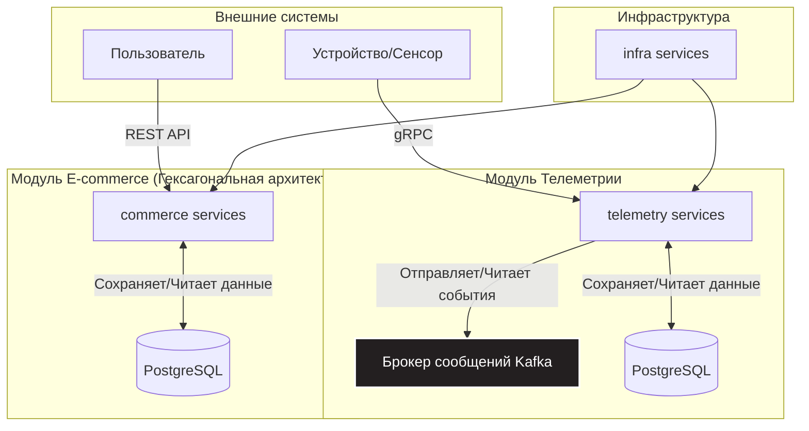

# Проект "Умный дом" (plus-smart-home-tech)

Система из двух независимых RESTful веб-сервисов, реализующих бэкенд для платформы "Умный дом" и связанного с ней E-commerce магазина.

---

### 🌟 Ключевые архитектурные решения и особенности

Этот проект демонстрирует применение различных архитектурных подходов для решения разных бизнес-задач в рамках одной системы:

*   **Чистая архитектура (DDD/Hexagonal):** Модуль `commerce` построен с использованием принципов Гексагональной архитектуры. Бизнес-логика (домен) полностью изолирована от внешних зависимостей (фреймворки, базы данных), что делает код легко тестируемым, гибким и долговечным.
*   **Асинхронное взаимодействие через Kafka:** Модуль `telemetry` использует **Apache Kafka** для приема и обработки потока данных от сенсоров. Это обеспечивает отказоустойчивость и масштабируемость системы телеметрии, позволяя обрабатывать высокие нагрузки без потери данных.
*   **Высокопроизводительный протокол gRPC:** Взаимодействие с устройствами (сенсорами) реализовано через **gRPC**, что гарантирует строгие контракты API (Protobuf) и высокую производительность по сравнению с традиционным REST.
*   **Паттерны Spring Cloud (Microservices Foundation):** Система построена на проверенных временем микросервисных паттернах: **Service Discovery** (Eureka) для динамического обнаружения сервисов, **Cloud Config** для централизованного управления конфигурацией и **API Gateway** для унификации точки входа.

---

### 🏗️ Архитектура системы

Бизнес-функции системы реализуются двумя логическими модулями `commerce` и `telemetry`, которые могут быть развернуты и масштабированы независимо друг от друга. Модуль `infra` реализует паттерны `Cloud Config`, `Service Discovery` и `API Gateway`.



---

### ⚙️ Технологический стек

*   **Язык:** Java 21
*   **Фреймворк:** Spring Boot 3.5
*   **База данных:** PostgreSQL
*   **Взаимодействие:**
    *   REST API (для `commerce`)
    *   gRPC (для `telemetry`)
    *   Apache Kafka (для асинхронных событий в `telemetry`)
*   **ORM:** Spring Data JPA
*   **Контейнеризация:** Docker, Docker Compose
*   **Качество кода:** Lombok

---

### 📦 Описание модулей

#### `telemetry` (Сервис сбора телеметрии)
Этот сервис отвечает за регистрацию "умных" устройств и отслеживание их показаний, а также добавление и обработку пользовательских сценариев.
*   **API:** Предоставляет **gRPC** эндпоинты для регистрации сенсоров, создания сценариев и отправки данных.
*   **Обработка данных:** Входящие данные от сенсоров публикуются в топик **Kafka** для дальнейшей асинхронной обработки и анализа сценариев. В случае выполнения условий сценария осуществляется обращение к соответствующему устройству по протоколу **gRPC**.
*   **Архитектура:** Классическая слоистая архитектура (Controller -> Service -> Repository).

#### `commerce` (Сервис электронной коммерции)
Бэкенд для онлайн-магазина, где пользователи могут покупать устройства.
*   **API:** Предоставляет **REST API** (доступно через API Gateway) для управления пользователями, товарами и заказами.
*   **Архитектура:** Реализована **Гексагональная архитектура (Порты и Адаптеры)**.
    *   **Ядро (Domain):** Содержит чистые бизнес-сущности и логику, не зависит ни от каких фреймворков.
    *   **Порты (Application):** Определяют интерфейсы взаимодействия с ядром (use cases).
    *   **Входящие адаптеры (Presentation):** Реализуют внешние порты — Spring REST-контроллеры.
    *   **Исходящие адаптеры (Infrastructure):** Реализуют внутренние порты — репозитории на основе Spring Data JPA.
> 💡 **Почему была выбрана такая архитектура?** *Такой подход был выбран для максимальной изоляции бизнес-логики от деталей реализации. Это делает код надёжным и легко тестируемым благодаря разделению ответственности и облегчает будущие технологические изменения (например, замену PostgreSQL на NoSQL решение или добавление GraphQL API) без затрагивания ядра бизнес-логики.*

---

### 🚀 Запуск с использованием Docker Compose

Конфигурация Docker Compose присутствует только для модулей `telemetry` и `infra`. Конфигурация для модуля `commerce` на данный момент не реализована.

1.  Убедитесь, что у вас установлены `Docker` и `Docker Compose`.
2.  Склонируйте репозиторий: `git clone https://github.com/impatient0/plus-smart-home-tech`
3.  Перейдите в корневую директорию проекта.
4.  Выполните команду для сборки и запуска сервисов и баз данных:
    ```bash
    docker compose up --build
    ```
5.  gRPC API будет доступно по адресу `grpc://localhost:9090`

---

### 🧑‍💻 Локальный запуск для разработки (IntelliJ IDEA)

Локальный запуск требует ручного старта всех сервисов в правильной последовательности.

1. Добавьте проект в IntelliJ IDEA (`Menu -> New -> Project from Version Control...`).
2. Выполните `mvn clean install` в корневой директории проекта для генерации Q-типов, классов Avro и Protobuf, и т.п.
3. Запустите конфигурацию `docker-db-Kafka` для старта инфраструктуры.
4. Запустите сервисы модуля `infra` в следующей последовательности: `EurekaServerApp`, `ConfigServerApplication`, `GatewayApplication`.
5. Запустите сервисы модуля `telemetry` (в любой последовательности): `AggregatorApplication`, `AnalyzerApplication`, `CollectorApplication`.
6. Запустите сервисы модуля `commerce` (в любой последовательности): `DeliveryApplication`, `OrderApplication`, `PaymentApplication`, `ShoppingCartApplication`, `ShoppingStoreApplication`, `WarehouseApplication`.
7. Сервисы будут доступны по следующим адресам:
    *   **Commerce Service (REST):** `http://localhost:8888`
    *   **Telemetry Service (gRPC):** `grpc://localhost:9090`

---

### 📖 API

API каждого сервиса списано в соответствующем файле OpenAPI спецификации в [commerce/interaction-api/src/main/resources/specs](https://github.com/impatient0/plus-smart-home-tech/tree/main/commerce/interaction-api/src/main/resources/specs) (обратите внимание, что все спецификации ссылаются на общий `common.json`).

*Для демонстрации работы API рекомендуется использовать Postman для REST-запросов к `commerce` и, например, `grpcurl` или BloomRPC для gRPC-запросов к `telemetry`.*

Протестировать API сервиса `commerce` можно с помощью [этой Postman-коллекции](https://github.com/yandex-praktikum/plus-smart-home-tech/blob/ci/.github/workflows/stuff/postman/9-gateway-microservices/postman.json).